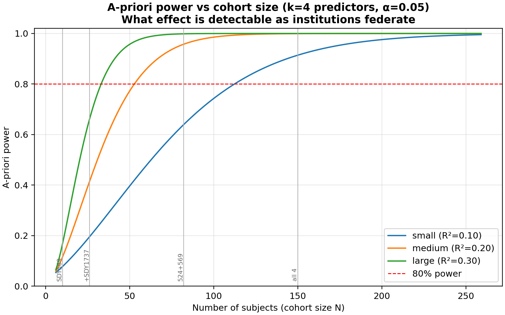
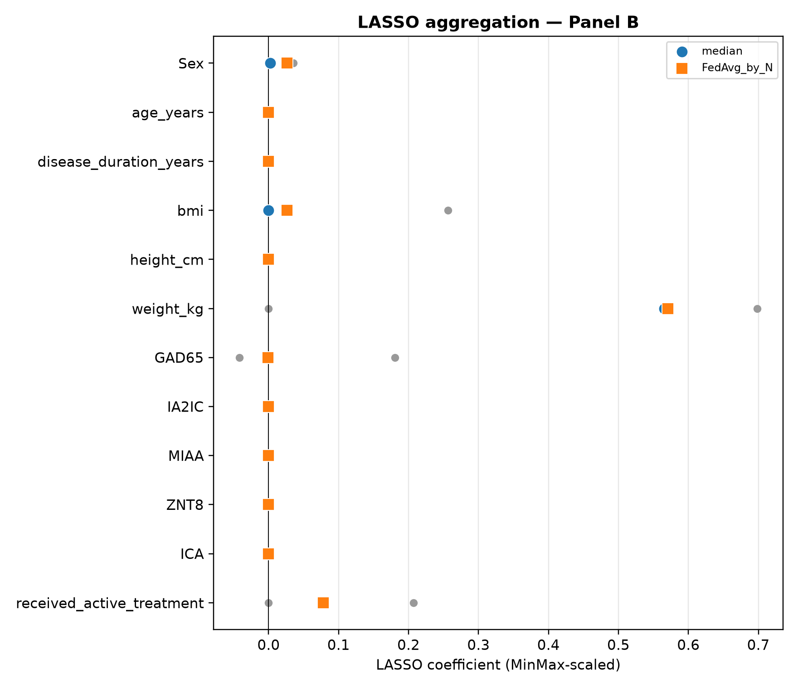
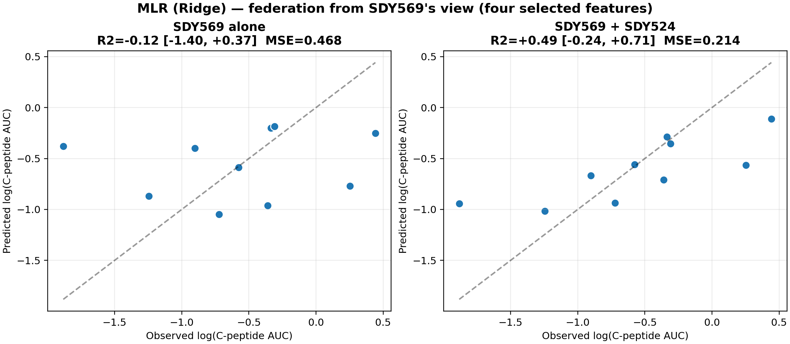
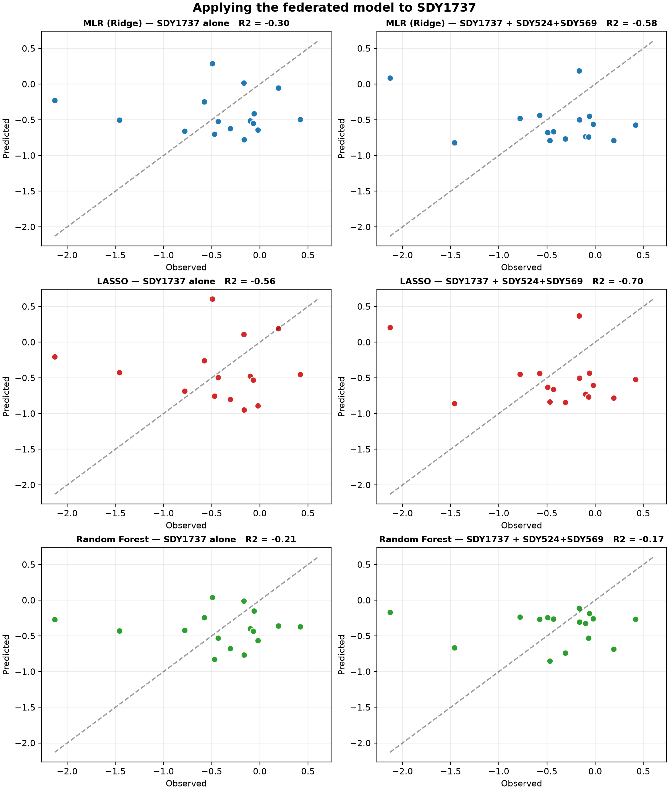

# Federated Learning: a privacy-preserving strategy for prediction

**BioITWorld 2026 · Anne Deslattes Mays, Ph.D.**

A markdown rendering of the talk, aligned to the notebooks. The full deck is
[`slides/2026BioITWorld_Federated_Learning_v9.pdf`](slides/2026BioITWorld_Federated_Learning_v9.pdf).
Figures below are generated by the notebooks (see [`README.md`](README.md) for
how to reproduce).

---

## 1. Why federate: power rises with cohort size

Small institutional cohorts are underpowered. Federation lets institutions
build a larger effective cohort **without moving data** — only model parameters
are shared. The a-priori question is what effect a given cohort size can
detect:

A single institution of N≈10 cannot fit a 4-feature model with any power; the
federated cohort can. *(We report power only a-priori — never post-hoc from an
observed R².)*

---

## 2. The data: four T1D autoantibody cohorts

| Study | N | Drug arm | Extended (body comp) |
|---|---|---|---|
| SDY524 (AbATE) | 72 | hOKT3 (anti-CD3) | yes |
| SDY569 (Herold II) | 10 | teplizumab (anti-CD3) | yes |
| SDY1737 (Aralast) | 16 | alpha-1 antitrypsin | yes |
| SDY797 (T1DAL) | 49 | alefacept (anti-CD2) | no |

Target: log(C-peptide 4-hour AUC). Panel A = 5 autoantibodies + age + sex.
Panel B = Panel A's biology plus body composition, disease duration, and
treatment.

---

## 3. Preprocessing problem: assays are on different scales

GAD65 ranges 0–1155 IU/ml in one study and is recorded 0/1 in another. Each
institution **min–max scales its own features** before sharing any coefficient —
the federated preprocessing step. No global statistics cross institutions.

---

## 4. Feature selection: federated LASSO keeps four features

LASSO with ADMM consensus (Panel B, concordant studies) zeros all but four
features:

**weight_kg +0.97 · GAD65 −0.12 · received_active_treatment +0.08 · Sex +0.06.**
GAD65 negative is the expected immune-destruction sign: more autoantibody → less
C-peptide.

---

## 5. Treatment, done right: transitive closure

`received_active_treatment` is derived subject → arm → treatment from the
ImmPort arm files — not from a free-text field. This corrected SDY569, whose
arm codes (`1`/`2`) a naive rule had mapped to *all-untreated*; the closure
recovers 6 treated / 4 control.

---

## 6. Federation from one institution's view

Each institution applies the others' coefficients to its **own** subjects. The
small institution gains the most:

SDY569 alone cannot predict; with the larger study's coefficients it can. **Read
the confidence interval** — small N makes it wide, and this is a *transfer* of
the big study's model onto the small study, not a within-institution power gain.

---

## 7. What does NOT work — the honest cases

- **SDY1737** (different trial, alpha-1 antitrypsin) is discordant — the
  coefficients do not transfer.
- **SDY797** lacks body composition and has binary autoantibodies — it cannot
  join the rich model.

Federation is not magic: it needs concordant institutions sharing the same
predictive features.

---

## 8. The wart you must state: it is body size, not autoantibodies

`weight_kg` dominates, and it correlates with C-peptide at r = 0.67–0.93 — so do
height and age. C-peptide AUC is **not** body-size normalized. Age-at-onset is
the known predictor of residual C-peptide; weight proxies it.

**So the predictive signal is demographics (body size / age), not the
autoantibody profile.** The autoantibodies alone do not predict residual
beta-cell function.

---

## 9. Takeaways

1. The autoantibody panel alone is **not** predictive of residual beta-cell
   function.
2. The extended panel predicts — but largely through a body-size / age
   confound, not immunology.
3. Federation can build cohort size without moving data; the aggregation rule
   depends on the method (FedAvg / median / ADMM / union-of-forests).
4. Feature selection before federation is worthwhile.
5. Honesty about confounds, small-N uncertainty, and transfer-vs-power is what
   makes the result credible.

---

*Reproduce every figure: `conda env create -f environment.yml`, then run the
notebooks in `ipynb/` (Stage 1 → Stage 2). See [`README.md`](README.md).*
